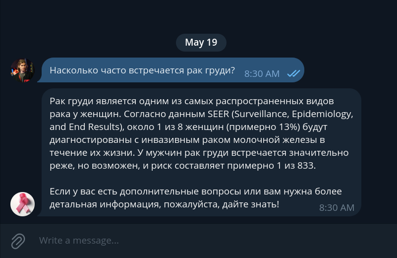

## Setup

```bash
docker-compose up --build
```

Для корректной работы OpenAI API нужен VPN!

ссылка на бота tg: https://t.me/dalshefond_support_bot

ссылка на папку ``data`` (обязательна для скачивания)

credentials заполняются в `.env`

## Solution
* telegram bot
* streamlit web app
* openai LLM модель для ответов на вопросы

## Additional materials

- [Presentation](https://docs.google.com/presentation/d/1BcdFLT8iI9ciLSWO5948rsZ-FlPaijCCQg2Iu0VgUCg/edit?usp=sharing)
- [Full Task Description](https://docs.yandex.ru/docs/view?url=ya-disk-public%3A%2F%2Fi2%2BuSEGMxQ%2BjyO8CzOAT2b94EdcmAbuVfje9%2F1xu8Fq2YTTP%2FFeweY9qmSLH1Me6q%2FJ6bpmRyOJonT3VoXnDag%3D%3D&name=%D0%9A%D0%B5%D0%B9%D1%81%20%D0%BE%D1%82%20%D0%B1%D0%BB%D0%B0%D0%B3%D0%BE%D1%82%D0%B2%D0%BE%D1%80%D0%B8%D1%82%D0%B5%D0%BB%D1%8C%D0%BD%D0%BE%D0%B3%D0%BE%20%D1%84%D0%BE%D0%BD%D0%B4%D0%B0%20%D0%94%D0%B0%D0%BB%D1%8C%D1%88%D0%B5.pdf&nosw=1)

